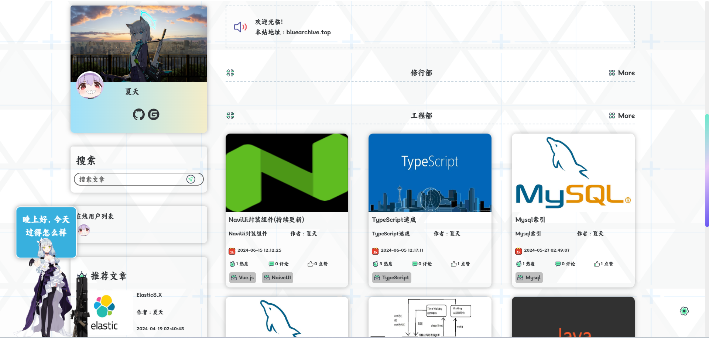
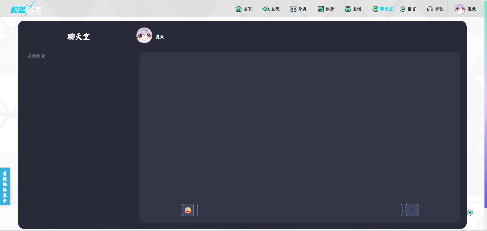

## BlueArchiveBlog
碧蓝档案多人主题博客

## 网站地址
[bluearchive.top](http://www.bluearchive.top/)

## 技术栈
前端技术: Vue3(博客前端),Naive UI,Artplayer(播放器),v-md-editor(文本编辑器)

后端技术：Java,SpringBoot,SpringCloud,MySQL,Mybatis-Plus,Redis,Nginx,Docker,Docker-Compose,Nacos,GateWay,Sentinel,RabbitMQ,
Elasticsearch,Kibana等

## 项目地址
- 博客地址(Gitee)：https://gitee.com/xiatianYa1003/BlueArchiveBlog.git
- 博客地址(Github)：https://github.com/xiatianYa/BlueArchiveBlog.git

## 本地启动
Vue2：
1. npm install
2. npm run dev

Vue3：
1. npm install
2. npm run dev

## 项目介绍
希望这个多人博客项目能够帮助到更多的人,也希望能帮助到各位技术水平提升能有帮助,喜欢的话也可以star一下=w=。
## 网站简介
这个项目是基于SpringCloud+Vue2+Vue3构建,是作者基于2024年毕业设计的产物,也满足了自己写知识笔记,做知识分享的目的。
网站有两个模块:
- 用户端(Vue3): 文章模块,番剧模块,二创模块,编程工具,相册模块,用户模块,友情链接,聊天室,留言模块,听歌模块。
- 管理端(基于若依开发Vue2): 友链管理,审核管理,博客信息管理,文章管理,资源管理,博客分类管理,博客管理,系统监控,系统工具,系统管理。
## 网站示例（详细示例请见官方网站：[bluearchive.top](http://www.bluearchive.top/))

### 碧蓝档案主题博客
#### 首页

#### 番剧

#### 分类

#### 相册

#### 友情链接

#### 聊天室

#### 留言

#### 听歌

#### 用户菜单

## 更新进度

### 2024-6-24
- 完成博客搭建基本功能

========================================================================

## 使用功能
大部分用户需要用户去进行注册使用,目前暂时仅支持手机号,后续会支持更多登录方式。

